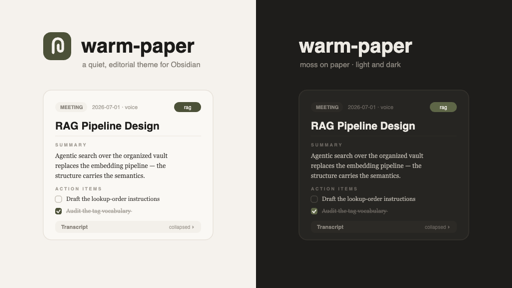

# Warm Paper

A quiet, editorial Obsidian theme. Warm off-white surfaces, one deep moss
accent, generous radius, Georgia for reading — no gradients, no neon,
nothing fighting for your attention.

## Install

**From Obsidian's theme browser (recommended):** **Settings → Appearance →
Themes → Manage**, search "Warm Paper", select it.

**Manually:**

1. Download `theme.css` and `manifest.json` from this repo.
2. In your vault, create the folder `.obsidian/themes/Warm Paper/` and put
   both files inside it.
3. In Obsidian: **Settings → Appearance → Themes**, select **Warm Paper**.

## Light and dark

Both are fully supported. Switch in **Settings → Appearance → Base color
scheme**.

## Palette

| Token | Light | Dark |
|---|---|---|
| Editor canvas | `#FAF8F4` | `#1E1D1B` |
| Sidebars/workspace | `#F5F2ED` | `#1E1D1B` |
| Surface (cards, popovers) | `#FFFFFF` | `#262522` |
| Text | `#1C1B19` | `#EDEAE4` |
| Muted text | `#8A857D` | `#8A857D` |
| Accent (moss) | `#4C5138` | `#5E6647` |

## Type

Hanken Grotesk for interface chrome (embedded, one variable-font file
covers weights 400–700), Georgia for reading and editing body text, SF
Mono/Menlo for code and paths.

## License

MIT — see [LICENSE](LICENSE).
